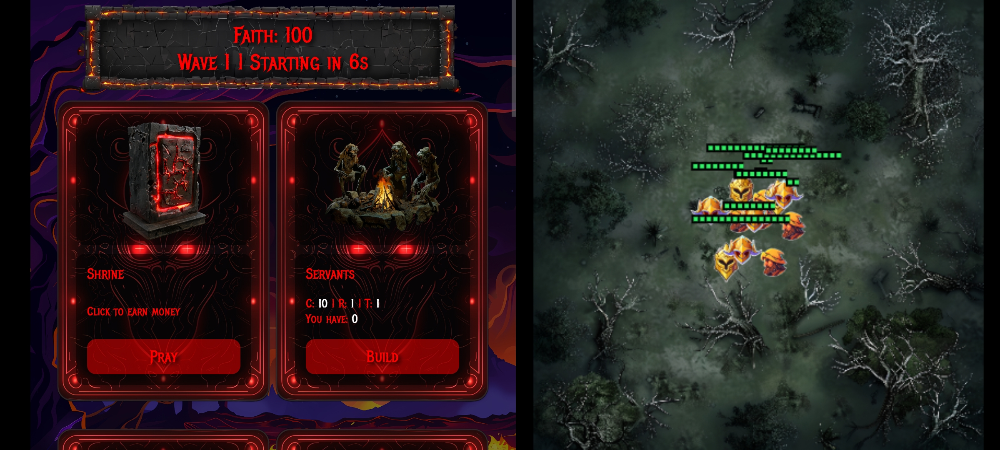
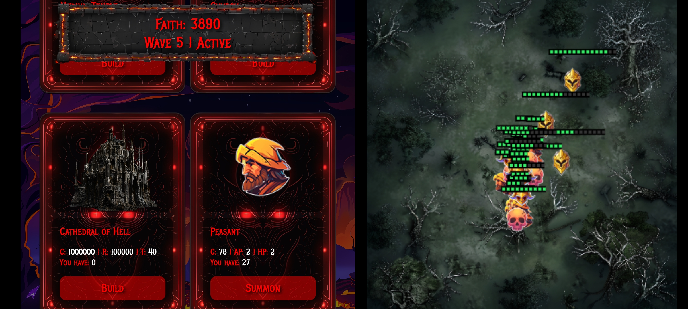
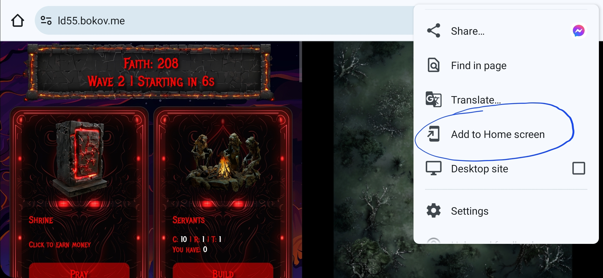

# Colonier Games - Ludum Dare 55

Welcome to _Colonier Games's_ submission for the _55th Ludum Dare_! [Ludum Dare](https://ldjam.com) is a game jam, held twice a year. We are participating for the 11th time in this jam. The theme of LD 55 is: _Summoning_.

## Playing

[Click here](https://ld55.bokov.me) to play the game in your browser!

## Screenshots


## Mobile Screenshots





_Please install the PWA to your home screen, and launch it from there for full-screen game experience! The screenshot below shows you how to do it._



## Building

To build the game, do the following:

* First, install dependencies of the project

```
$ npm install
```

* To run the game, you can use the following command

```
$ npm run serve
```

* To be able to deploy the game in a production environment, you must first build it, which produces the `dist/` directory.

```
$ npm run build
```
